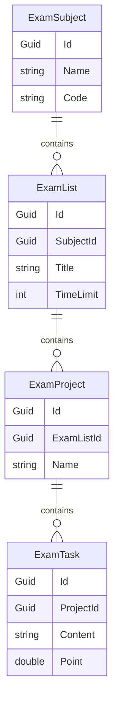

# Examination Module - DATERP

Module Examination là một phần cốt lõi của hệ thống **DATERP**, tập trung vào việc quản lý cấu trúc đề thi, dự án và các tác vụ cho các chứng chỉ tin học văn phòng như **MOS (Microsoft Office Specialist)** và **IC3**.

## 🏗 Kiến trúc (Architecture)

Module tuân thủ nghiêm ngặt mô hình **ABP Modular Monolith**, đảm bảo tính độc lập và sẵn sàng chuyển đổi sang Microservices khi cần thiết.

### Các Layer:
- **.Domain**: Chứa các thực thể (Entities), Domain Services và Interfaces DbContext.
- **.Domain.Shared**: Chứa các kiểu liệt kê (Enums), hằng số (Constants) và các tài nguyên đa ngôn ngữ.
- **.Application.Contracts**: Định nghĩa các DTOs (Data Transfer Objects) và interfaces cho App Services.
- **.Application**: Triển khai logic nghiệp vụ và cấu hình ánh xạ AutoMapper.
- **.EntityFrameworkCore**: Thực thi việc ánh xạ cơ sở dữ liệu và quản lý DbContext.

## 📊 Cấu trúc Dữ liệu Phân cấp (Hierarchy)

Dữ liệu được tổ chức theo cấu trúc 4 cấp để phản ánh chính xác các kỳ thi thực tế:

1.  **ExamSubject (Môn thi)**: Ví dụ: Word, Excel, PowerPoint.
2.  **ExamList (Bộ đề)**: Mỗi môn thi có nhiều bộ đề (ví dụ: Đề luyện tập 1, Đề 2).
3.  **ExamProject (Dự án)**: Một bộ đề gồm nhiều dự án thực tế.
4.  **ExamTask (Câu hỏi/Tác vụ)**: Mỗi dự án gồm nhiều yêu cầu nhỏ người dùng cần thực hiện.

### Sơ đồ quan hệ thực thể (ERD):

## 🚀 Tính năng chính

- **Quản lý phân cấp**: Hỗ trợ đầy đủ các thao tác CRUD cho cả 4 cấp độ dữ liệu.
- **Auto Data Seeding**: Tự động nạp dữ liệu mẫu cho các môn thi phổ biến ngay khi khởi tạo hệ thống.
- **Conventional Controllers**: Các API được tự động tạo ra dựa trên App Services.
- **Audit Logging**: Tích hợp sẵn hệ thống theo dõi thay đổi dữ liệu của ABP.

## 🛠 Hướng dẫn sử dụng

### 1. Thêm môn thi mới qua App Service:
Sử dụng `IExamSubjectAppService` để quản lý các môn thi cơ bản.

### 2. Tích hợp giao diện:
Module này cung cấp nền tảng dữ liệu (Backend). Các trang Web (UI) nên được triển khai trong dự án `DATERP.Web` để tiêu thụ các API từ module này.

### 3. Localization:
Các chuỗi thông báo và tiêu đề nên được định nghĩa trong `.Domain.Shared` để hỗ trợ đa ngôn ngữ (Tiếng Việt, Tiếng Anh).

---
*Tài liệu này được tạo tự động bởi Antigravity Agent.*
